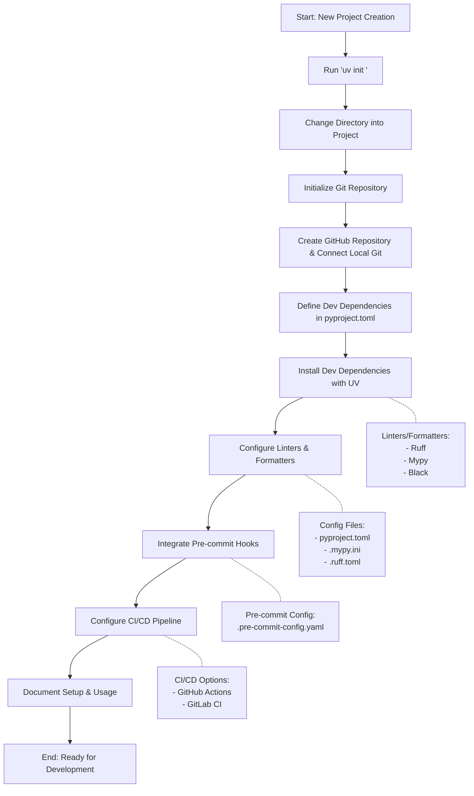

## Revised Process Flow: Setting Up a Python Project with UV & Linters



# 🚀 Python Project Setup Checklist (UV + Linters)

## 🔧 Phase 1: Project Initialization
1. **Initialize with UV**  
   Run 
   ```bash
   uv init my-awesome-project-template
   ```

   to create project structure  
   - Creates directory, pyproject.toml, and .venv  
   - Virtual environment auto-activates  

3. **Enter project directory**  
   ```bash
   cd my-awesome-project-template
   ```
   - Reactivate venv in new terminals if needed  

4. **Initialize Git**  
   Run
   ```bash
   git init
   ```
   - Add Python-specific .gitignore
     using [https://github.com/gitignore/Python.gitignore](https://github.com/gitignore/Python.gitignore)  

6. **Connect to GitHub**  
   - Create empty remote repo  
   - Push initial commit with
   ```bash 
   git add .
   git commit -m "feat: Initial project structure with uv init"
   git remote add origin https://github.com/<your-username>/my-awesome-project-template.git
   git branch -M main
   git push -u origin main
   ```

7. **Configure dependencies**  
   Edit `pyproject.toml` to add:  
   - Production dependencies
        ```bash  
   [project]
name = "my_awesome_project"
version = "0.1.0"
dependencies = [
    "requests~=2.31",
    "fastapi~=0.104",
]

[project.optional-dependencies]
dev = [
    "ruff~=0.1",
    "mypy~=1.7",
    "pre-commit~=3.6",
    "pytest~=7.4",
]
```  
   - Dev tools (Ruff, Mypy, etc)  
   Install with
```
uv pip install -e ".[dev]"
```


## ✨ Phase 2: Quality Tools
6. **Set up Ruff**  
   Add lint/format config to --REPLACE CODE TAG HERE--  
   - Recommended rule sets  
   - File exclusions  

7. **Configure Mypy**  
   Add type checking rules to --REPLACE CODE TAG HERE--  
   - Strict settings  
   - Version compatibility  

8. **(Optional) EditorConfig**  
   Create --REPLACE CODE TAG HERE-- for cross-IDE consistency  

## ⚙️ Phase 3: Automation
9. **Pre-commit hooks**  
   Configure --REPLACE CODE TAG HERE-- with:  
   - Ruff checks  
   - Mypy validation  
   Install hooks with --REPLACE CODE TAG HERE--  

10. **CI/CD Pipeline**  
    Set up --REPLACE CODE TAG HERE-- to run:  
    - Linting on push/PR  
    - Type checking  
    - Format verification  

## 📝 Phase 4: Finalization
11. **Add example code**  
    - Type-hinted module  
    - Test cases  

12. **Document setup**  
    Update --REPLACE CODE TAG HERE-- with:  
    - Environment setup  
    - Common commands  
    - Tool explanations  

13. **Verify workflow**  
    - Test pre-commit blocks  
    - Confirm CI passes  
    - Document all steps  
