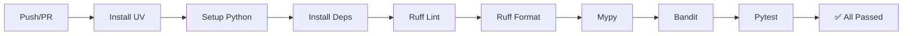

# 🚀 Python Project Template (UV + Ruff + Mypy)

A modern Python project template using **UV** for package management, **Ruff** for linting/formatting, **Mypy** for type checking, and **Pre-commit** for automated quality gates.

## 📋 Table of Contents

- [🚀 Python Project Template (UV + Ruff + Mypy)](#-python-project-template-uv--ruff--mypy)
  - [📋 Table of Contents](#-table-of-contents)
  - [📁 Project Structure](#-project-structure)
  - [⚡ Quick Start](#-quick-start)
  - [🔧 Setup Guide](#-setup-guide)
    - [Phase 1: Project Initialization](#phase-1-project-initialization)
    - [Phase 2: Quality Tools](#phase-2-quality-tools)
    - [Phase 3: Automation](#phase-3-automation)
  - [🖥️ IDE Support](#️-ide-support)
    - [VS Code](#vs-code)
    - [PyCharm](#pycharm)
    - [Other IDEs](#other-ides)
  - [📌 Common Commands](#-common-commands)
  - [📜 License](#-license)

## 📁 Project Structure

    my-awesome-project-template/
    ├── .github/workflows/             CI/CD workflows
    │   ├── lint.yaml                  Lint, type check, security & test
    │   ├── test-matrix.yml            Multi-Python version tests
    │   ├── coverage-report.yml        Coverage reports
    │   ├── build-and-publish.yml      Package build & publish
    │   ├── pre-commit-check.yml       Pre-commit validation
    │   └── dependency-check.yml       Dependency auditing
    ├── src/
    │   ├── __init__.py
    │   └── my_awesome_project_template/
    │       ├── __init__.py
    │       ├── main.py                 Entry point
    │       └── py.typed                Mypy marker
    ├── tests/
    │   ├── __init__.py
    │   └── test_main.py               Test files
    ├── docs/                          Documentation
    ├── .editorconfig                  Cross-IDE formatting rules
    ├── .gitignore                     Git ignore rules
    ├── .pre-commit-config.yaml        Pre-commit hook definitions
    ├── .python-version                Python version (read by UV and CI)
    ├── pyproject.toml                 Project config and tool settings
    ├── uv.lock                        UV dependency lock file
    └── README.md

## ⚡ Quick Start

1. Clone the template
2. Run `uv venv` to create virtual environment
3. Run `uv pip install -e ".[dev]"` to install dependencies
4. Run `pre-commit install` to set up hooks
5. Run `pre-commit install --hook-type commit-msg` for commit message linting
6. Run `uv run python -m my_awesome_project_template.main` to verify

## 🔧 Setup Guide

### Phase 1: Project Initialization

1. **Initialize with UV** — Run uv init my-project. This creates the directory, pyproject.toml, .venv, .python-version, and main.py.

2. **Enter project directory** — Run cd my-project.

3. **Initialize Git** — Run git init. Add a Python-specific .gitignore from github.com/github/gitignore. Also add IDE-specific ignores for .idea/ and cache directories.

4. **Connect to GitHub** — Create an empty remote repo, then run git add, commit, remote add origin, branch -M main, and push.

5. **Configure dependencies** — Edit pyproject.toml to add production dependencies and dev tools (Ruff, Mypy, Pytest, Bandit, pre-commit, pytest-cov).

6. **Install dev dependencies** — Run uv pip install -e ".[dev]"

### Phase 2: Quality Tools

All tool configuration lives in **pyproject.toml** — no separate config files needed.

7. **Ruff** (Linter + Formatter — replaces Black, Flake8, isort) — Configure line-length, target-version, lint rules, format settings, and per-file ignores in the [tool.ruff] sections of pyproject.toml.

8. **Mypy** (Type Checker) — Configure python_version, strict settings, and import overrides in [tool.mypy] section of pyproject.toml. The package includes `py.typed` marker for proper type checking.

9. **Pytest** (Testing) — Configure pythonpath, testpaths, addopts, and coverage requirements in [tool.pytest.ini_options] section. **100% coverage is required** (`--cov-fail-under=100`).

10. **EditorConfig** (Cross-IDE consistency) — The `.editorconfig` file ensures consistent formatting across VS Code, PyCharm, and other IDEs.

    It defines indent style, charset, line endings, and per-filetype overrides.

    ```ini
    root = true

    [*]
    indent_style = space
    indent_size = 4
    end_of_line = lf
    charset = utf-8
    trim_trailing_whitespace = true
    insert_final_newline = true

    [*.py]
    max_line_length = 120

    [*.{yml,yaml,json,jsonc,toml}]
    indent_size = 2

    [*.md]
    trim_trailing_whitespace = false
    ```

### Phase 3: Automation

11. **Pre-commit hooks** — The `.pre-commit-config.yaml` runs these checks on every commit:

    | Hook             | Purpose                                           |
    | ---------------- | ------------------------------------------------- |
    | pre-commit-hooks | Trailing whitespace, merge conflicts, large files |
    | ruff             | Lint + auto-fix                                   |
    | ruff-format      | Code formatting                                   |
    | mypy             | Type checking                                     |
    | bandit           | Security scanning                                 |
    | gitlint          | Commit message format                             |
    | gitleaks         | Secret detection                                  |

    Install hooks:

    ```bash
    pre-commit install
    pre-commit install --hook-type commit-msg
    ```

    Run manually on all files:

    ```bash
    pre-commit run --all-files
    ```

12. **CI/CD Pipeline**

    Multiple workflows run on every push/PR to main and develop:

    | Workflow | Purpose |
    | -------- | ------- |
    | `lint.yaml` | Ruff lint + format, Mypy type check, Bandit security, Pytest |
    | `test-matrix.yml` | Test on Python 3.11, 3.12, 3.13 |
    | `coverage-report.yml` | Generate and upload coverage reports |
    | `pre-commit-check.yml` | Run pre-commit hooks in CI |
    | `dependency-check.yml` | Audit dependencies weekly |
    | `build-and-publish.yml` | Build and publish to PyPI |

    **Required: 100% test coverage** — Pipeline fails if coverage drops below 100%.


## 🖥️ IDE Support

### VS Code

Recommended extensions:

- Python + Pylance
- Ruff
- Python Debugger
- Mypy Type Checker
- GitHub Copilot Chat

VS Code reads tool configs from `pyproject.toml`. Use `uv run` commands in terminal for full toolchain.

### PyCharm

- Install the **Ruff plugin** from the marketplace
- PyCharm natively reads pyproject.toml for tool configuration
- .editorconfig is supported out of the box

### Other IDEs

- .editorconfig provides universal formatting rules
- All tool configs in pyproject.toml work with CLI tools regardless of IDE

## 📌 Common Commands

```bash

──────────────── Environment ───────────────────
uv venv # Create virtual environment
uv pip install -e ".[dev]" # Install all dev dependencies
uv run python -m my_awesome_project_template.main # Run the project

──────────────── Linting & Formatting ───────────────────
uv run ruff check . # Run linter
uv run ruff check . --fix # Run linter with auto-fix
uv run ruff format . # Format code
uv run ruff format --check . # Check formatting (no changes)

──────────────── Type Checking ───────────────────
uv run mypy . # Run type checker

──────────────── Security ───────────────────
uv run bandit -r src/ -c pyproject.toml # Run security scanner

──────────────── Testing ───────────────────
uv run pytest # Run tests (fails if coverage < 100%)
uv run pytest --cov=src --cov-report=term-missing # Run with coverage
uv run pytest -v --tb=short # Verbose with short traceback

──────────────── Pre-commit ───────────────────
pre-commit install # Install hooks
pre-commit install --hook-type commit-msg # Install commit-msg hook
pre-commit run --all-files # Run all hooks manually
pre-commit autoupdate # Update hook versions

──────────────── Git ───────────────────
git add .
git commit -m "feat: your message" # Triggers pre-commit hooks
git push


```
Pipeline steps (100% coverage required):


```mermaid
graph LR
A[Push/PR] --> B[Install UV]
B --> C[Setup Python]
C --> D[Install Deps]
D --> E[Ruff Lint]
E --> F[Ruff Format]
F --> G[Mypy]
G --> H[Bandit]
H --> I[Pytest]
I --> J[✅ All Passed]
```

## 📜 License

Add your license here.
